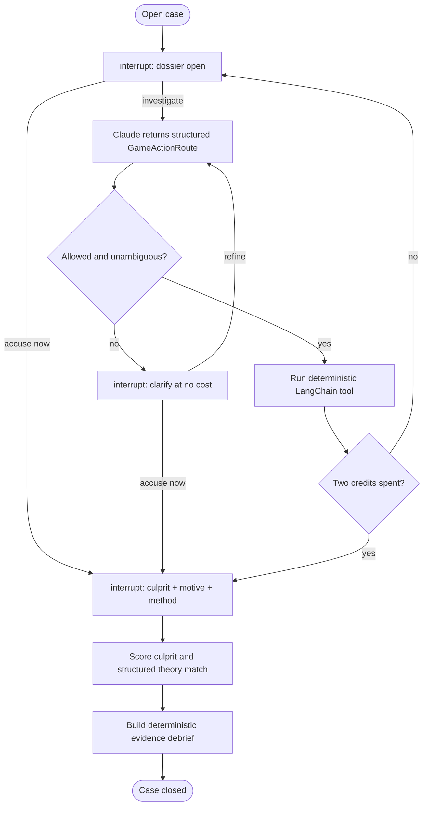

# Case Closed? 🔎

## [Play online →](https://midnight-lumen-museum.streamlit.app)

Open the Lumen Museum case in your browser—no installation required.

[](https://github.com/DuyPham97/case-closed-langgraph/actions/workflows/ci.yml)


The *Aurora Circuit* has vanished during a blackout at the Lumen Museum. You can freely browse
the scene, map, suspect files, timeline, and twelve original records. If the pattern is still
unclear, spend up to two optional deep-dive credits before naming the culprit, motive, and method.

## Play locally

Requirements: Python 3.12+, [`uv`](https://docs.astral.sh/uv/), and an Anthropic API key with
Claude Haiku 4.5 access.

```bash
git clone https://github.com/DuyPham97/case-closed-langgraph.git
cd case-closed-langgraph
uv sync --frozen
cp .env.example .env
```

Add your key to `.env`:

```dotenv
ANTHROPIC_API_KEY="your-key"
ANTHROPIC_MODEL="claude-haiku-4-5-20251001"
ANTHROPIC_WORKSPACE_ID=""
```

`ANTHROPIC_WORKSPACE_ID` is optional. Leave it blank unless your Anthropic account requires an
explicit workspace header.

Start the game:

```bash
uv run streamlit run src/case_closed/app.py
```

Open [http://localhost:8501](http://localhost:8501), then follow the caseboard. Stop the server
with `Ctrl+C`.

## How the game works

1. **Browse the whole case.** The crime scene, museum map, four suspects, known timeline, and
   twelve original records are open from the start. Browsing never spends a credit, and the base
   dossier is sufficient to solve the mystery.
2. **Optionally test a lead.** Write an inquiry in ordinary language. Claude maps it onto one of
   six bounded cross-person interviews or record checks, then a deterministic LangChain tool
   returns the scripted follow-up. An ambiguous request enters a clarification loop without
   spending a credit. At most two successful deep dives can run.
3. **Accuse at any time.** Skip both credits, use one, or use both. Choose the culprit and explain
   the motive and method in your own words.

The case is solved only when:

```text
correct culprit AND (supported motive OR supported method)
```

A correct suspect with an unsupported theory—or a supported theory attached to the wrong
suspect—earns a partial result. When neither part fits, the case closes as failed. LangGraph then
builds the closing analysis from fixed public evidence, so the timeline cannot drift between
playthroughs.

## Architecture

The model interprets language; the graph owns the rules.



### LangChain

`PlayerGameGateway` is the model boundary. It creates a configured `ChatAnthropic` model and uses
native Pydantic structured outputs for two focused operations:

- `GameActionRoute` maps the player's free-form request onto a declared `GameAction` from
  `game_catalog.py`.
- `AccusationMatch` returns strict motive and method booleans instead of prose that application
  code would need to parse.

The graph constructs `GameDebrief` deterministically from the computed result and fixed dossier
facts. Claude never authors evidence, the timeline, or the closing reconstruction.

The executable case actions remain typed LangChain tools: `inspect_location`,
`interview_suspect`, and `compare_timeline`. Each one reads a predefined reveal route through
`CaseStore`; Claude chooses among allowed actions but never authors their results.

### LangGraph

`build_player_game_graph()` compiles a `StateGraph` over `PlayerGameState`. Its nodes seed the
open dossier, enforce the optional two-credit ceiling, run case tools, merge new follow-ups,
validate the accusation, and route ambiguous requests through a cost-free clarification branch.

The player interactions are real LangGraph `interrupt()` boundaries. `PlayerGameRuntime.resume()`
continues the same thread with `Command(resume=...)`, while `SqliteSaver` preserves the public
state across Streamlit reruns.

Conditional edges make the allowed transitions explicit:

- open dossier → investigate or accuse immediately;
- understood request → deterministic tool → open dossier;
- ambiguous request → clarification → routing or accusation;
- second successful tool → accusation;
- scored accusation → deterministic grounded debrief → terminal state.

## Deterministic case boundary

The model never receives permission to search arbitrary data or manufacture evidence. The
player-facing catalog contains six legal deep dives built from interviews and record comparisons.
The underlying LangChain boundary exposes typed `inspect_location`, `interview_suspect`, and
`compare_timeline` tools, and every declared route returns fixed observations from the bundled
case.

Public case material and the answer are physically separated:

```text
src/case_closed/cases/midnight_museum/
├── public.json     # suspects, locations, evidence, timelines, and reveal routes
└── solution.json   # culprit and canonical story used for final scoring
```

`solution.json` is loaded while scoring the final accusation and again only if the player opens the
post-verdict reconstruction. Culprit comparison is deterministic; the canonical story is passed
transiently to the structured motive/method matcher. Private solution data is never written into
`PlayerGameState`, tool results, evidence cards, public traces, or SQLite checkpoints.

## Tests and live evaluation

The normal test suite is offline. Graph tests inject a scripted gateway, resume every interrupt,
exercise clarification and failure paths, and assert that no private solution data enters saved
state. Tool tests use only bundled case files; they never contact Anthropic.

```bash
uv run pytest -q
uv run ruff check src tests evals
uv run ruff format --check src tests evals
uv build
```

Run the live Claude evaluation separately:

```bash
uv run python evals/run_evals.py
```

The live run uses the model configured in `.env` and may incur a small Anthropic charge.

## Project layout

```text
.
├── assets/
│   └── game/                     # museum map and illustrated case assets
├── src/case_closed/
│   ├── app.py                    # Streamlit game and caseboard
│   ├── game_catalog.py           # six optional, bounded deep dives
│   ├── game_schemas.py           # structured model and player boundaries
│   ├── game_state.py             # checkpoint-safe public state
│   ├── game_gateway.py           # two LangChain + Claude structured outputs
│   ├── game_graph.py             # interrupts, nodes, and conditional edges
│   ├── game_runtime.py           # SQLite assembly and resume helpers
│   ├── tools.py                  # deterministic LangChain case tools
│   ├── case_store.py             # validated public/private case loading
│   └── cases/midnight_museum/    # public case and private solution
├── tests/                        # offline unit and graph integration tests
├── evals/                        # optional live evaluation
└── .github/workflows/ci.yml
```

## Design choices

- **Base evidence makes the game fair.** A careful player can solve without calling the model
  router at all; deep dives are assistance, not a paywall around the answer.
- **Two optional credits create consequence.** A player can test only two of six follow-ups, so
  cross-person questions and contradictions matter.
- **Structured routing keeps free-form input safe.** Claude can understand ordinary language, but
  the graph accepts only cataloged actions and redirects uncertainty into clarification.
- **Scripted evidence keeps the mystery fair.** Replaying the same action always reveals the same
  facts, regardless of model variation.
- **One model is enough.** Routing and semantic theory matching are narrow structured operations;
  the final debrief stays deterministic, and extra role-playing agents would add cost without
  improving the game.
- **SQLite keeps play resumable.** Checkpointing is durable without requiring external
  infrastructure.

## Current scope

- One replayable mystery with a fixed answer.
- Four suspects, four mapped locations, twelve open records, and six optional deep dives.
- Hosted and local single-player Streamlit interface.
- One configured Anthropic model; no vector database or additional service is required.

## License

[MIT](LICENSE)
