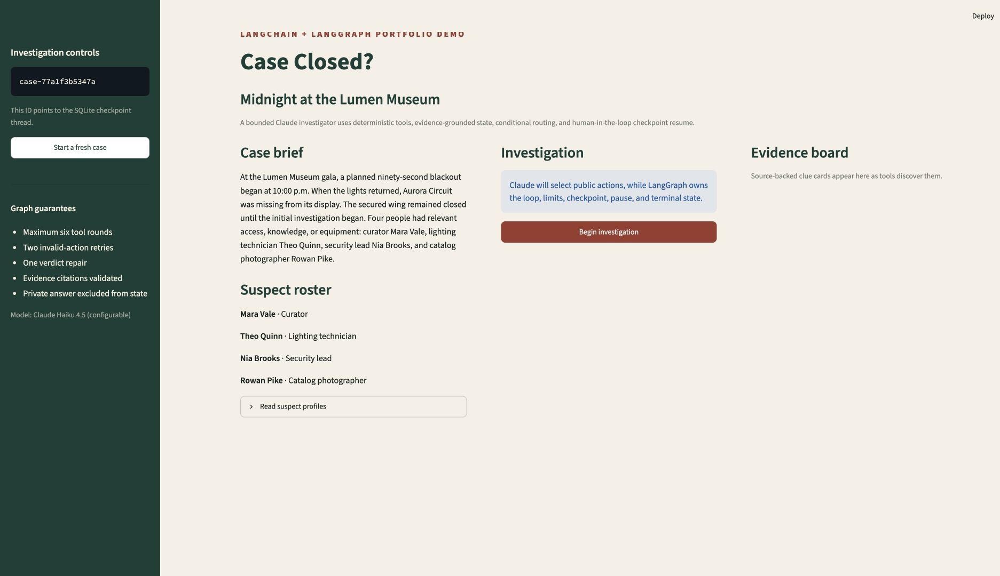
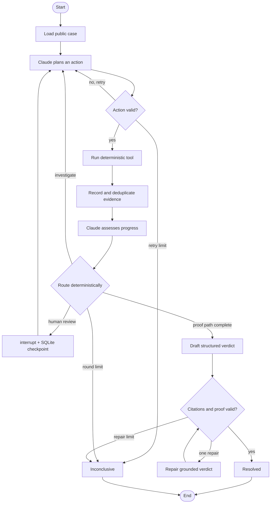

# Case Closed? 🔎

[](https://github.com/DuyPham97/case-closed-langgraph/actions/workflows/ci.yml)


An evidence-grounded AI detective investigates a fictional museum heist. Claude chooses
investigative actions; LangGraph owns the state, branching, bounded loop, human pause/resume,
SQLite checkpoints, and deterministic terminal conditions.

This is deliberately a small portfolio project: one polished mystery, one model, three local
tools, and enough orchestration to show why a graph is useful without hiding the idea behind a
large application.



## What it demonstrates

| Capability | Implementation |
|---|---|
| LangChain model integration | `ChatAnthropic` with native Pydantic structured output |
| LangChain tools | Typed `inspect_location`, `interview_suspect`, and `compare_timeline` tools |
| LangGraph state | JSON-safe `CaseState` with custom evidence and trace reducers |
| Conditional routing | Valid action, retry, investigate, interrupt, verdict, repair, or stop |
| Cycles with hard bounds | Six tool rounds, two action retries, and one verdict repair |
| Human in the loop | `interrupt()` plus `Command(resume=...)` using the same thread ID |
| Persistence | Durable SQLite checkpoints with cross-process resume by thread ID |
| Grounding | Verdict citations must be discovered and match an accepted proof path |
| Testability | Scripted gateway tests make zero live API or network calls |
| Evaluation | Correct culprit, valid citations, complete evidence path, and bounded termination |

## The mystery

During a planned 90-second blackout at the Lumen Museum gala, the light sculpture *Aurora
Circuit* appears to vanish. Four people had relevant access, knowledge, or equipment. The agent
must use source-backed records to establish three things:

1. When the artwork was actually removed.
2. Who had exclusive opportunity at that moment.
3. Who possessed or transported the missing 1.84 kg object.

The bundled case contains nine evidence records, four suspects, scripted interviews, sensor logs,
access records, and two timeline correlations.

## Why LangGraph instead of one prompt?

The model is intentionally **not** allowed to control the whole application. The graph validates
each proposed action, executes deterministic tools, deduplicates evidence, enforces retry limits,
pauses for a player, and checks the final citations against a solution that never enters the model
prompt or checkpoint state.



## Quick start

Requirements: Python 3.12+, [`uv`](https://docs.astral.sh/uv/), and an Anthropic API key with
Claude Haiku 4.5 access.

```bash
git clone https://github.com/DuyPham97/case-closed-langgraph.git
cd case-closed-langgraph
uv sync --frozen
cp .env.example .env
```

Add the key to `.env`:

```dotenv
ANTHROPIC_API_KEY="your-key"
ANTHROPIC_MODEL="claude-haiku-4-5-20251001"
ANTHROPIC_WORKSPACE_ID=""
```

An API key scoped to one workspace can leave `ANTHROPIC_WORKSPACE_ID` blank. An **All
workspaces** key must provide its `wrkspc_...` ID.

### Streamlit caseboard

```bash
uv run streamlit run src/case_closed/app.py
```

The caseboard shows suspect cards, discovered evidence, the public graph trace, the interrupt form,
and the grounded verdict. Refreshing does not erase SQLite checkpoints; the thread ID identifies
the saved investigation.

### Terminal version

```bash
uv run case-closed
```

Skip the human pause for a fully autonomous run:

```bash
uv run case-closed --autonomous
```

Example live result:

```text
Status: RESOLVED
Rounds used: 4 / 6
Culprit: Rowan Pike
Confidence: 88%
Evidence: E01, E02, E03, E04, E06, E07, E09
```

## Tests and evaluation

The normal test suite is offline: model behavior is injected through `ScriptedGateway`, and no test
contacts Anthropic.

```bash
uv run pytest -q
uv run ruff check src tests evals
```

Run one live evaluation with Claude:

```bash
uv run python evals/run_evals.py
```

The evaluator fails unless all five checks pass: resolved status, correct culprit, discovered-only
citations, a complete accepted evidence path, and termination within the round budget.

## Grounding and secret boundaries

The case is physically split into:

```text
src/case_closed/cases/midnight_museum/
├── public.json     # safe for tools and prompts
└── solution.json   # loaded only by deterministic validation/evaluation
```

“Hidden” means excluded from prompts, tool results, LangGraph state, trace payloads, and SQLite
checkpoints. The answer is still readable in this educational repository. Private validator
failures are collapsed to generic public feedback so they do not reveal the correct suspect.

The `.env` file and SQLite databases are ignored by Git. The SQLite saver receives an explicit
strict MessagePack allowlist, and tests check that unapproved types cannot be reconstructed and
private solution keys cannot enter graph state.

## Project layout

```text
.
├── src/case_closed/
│   ├── app.py              # Streamlit caseboard
│   ├── cli.py              # terminal interface
│   ├── graph.py            # StateGraph nodes, edges, loops, and interrupt
│   ├── gateway.py          # LangChain + Claude structured-output adapter
│   ├── tools.py            # deterministic LangChain tools
│   ├── state.py            # JSON-safe state and reducers
│   ├── validation.py       # action and private verdict validation
│   ├── runtime.py          # SQLite assembly and resume helpers
│   ├── evaluation.py       # deterministic acceptance metrics
│   └── cases/
├── tests/                  # offline unit and graph integration tests
├── evals/                  # optional live evaluation entrypoint
└── .github/workflows/ci.yml
```

## Design choices

- **One model, not role-playing agents.** Multiple personas would add cost without adding a useful
  orchestration problem.
- **Deterministic local tools, not RAG.** Nine records do not need a vector database, and Anthropic
  does not supply an embeddings model. Local tools keep the demo reproducible with one API key.
- **SQLite, not production infrastructure.** It clearly demonstrates checkpoint/resume while
  remaining a one-command local demo.
- **Public traces, not chain-of-thought.** The UI shows node outcomes and concise action summaries,
  never hidden model reasoning.

## Limitations

- The included mystery is fixed and its answer is visible to repository readers.
- SQLite is intended for a local demo, not a multi-user deployment.
- Live model trajectories vary; deterministic validators and hard limits keep those variations safe.
- The UI has no authentication because it is designed for local portfolio use.

## License

[MIT](LICENSE)
