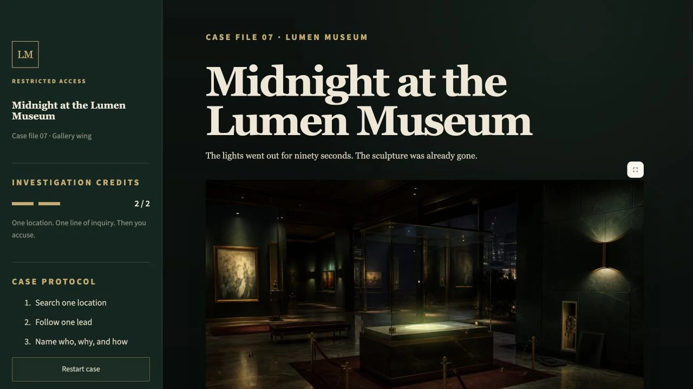
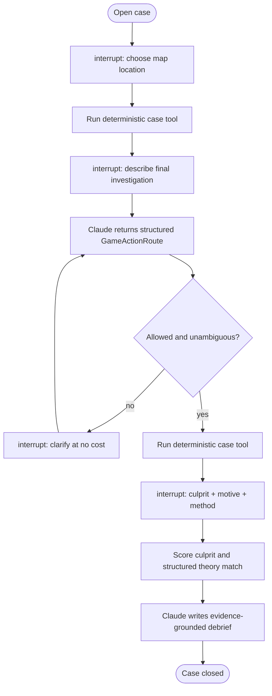

# Case Closed? 🔎

[](https://github.com/DuyPham97/case-closed-langgraph/actions/workflows/ci.yml)


The *Aurora Circuit* has vanished during a blackout at the Lumen Museum. You have four
suspects, a sealed museum wing, and exactly two investigations before you must name the culprit,
explain the motive, and reconstruct the method.



## Play locally

Requirements: Python 3.12+, [`uv`](https://docs.astral.sh/uv/), and an Anthropic API key with
Claude Haiku 4.5 access.

```bash
git clone https://github.com/DuyPham97/case-closed-langgraph.git
cd case-closed-langgraph
uv sync --frozen
cp .env.example .env
```

Add your key to `.env`:

```dotenv
ANTHROPIC_API_KEY="your-key"
ANTHROPIC_MODEL="claude-haiku-4-5-20251001"
ANTHROPIC_WORKSPACE_ID=""
```

`ANTHROPIC_WORKSPACE_ID` is optional. Leave it blank unless your Anthropic account requires an
explicit workspace header.

Start the game:

```bash
uv run streamlit run src/case_closed/app.py
```

Open [http://localhost:8501](http://localhost:8501), then follow the caseboard. Stop the server
with `Ctrl+C`.

## How the game works

The investigation budget is intentionally strict:

1. **Choose one location.** Select the display case, security screening desk, media locker, or
   lighting booth on the museum map. The chosen location reveals its scripted observations and
   evidence.
2. **Describe one final investigation.** Ask a suspect a question, request a record comparison,
   or describe what you want examined in natural language. Claude maps the request to one of the
   allowed case actions. It cannot invent a new clue or investigation. If the request is
   ambiguous, the game offers up to three valid directions and the clarification costs nothing.
3. **Make the accusation.** Choose the culprit and write both a motive and a method using what you
   discovered.

The case is solved only when:

```text
correct culprit AND (supported motive OR supported method)
```

A correct suspect with an unsupported theory—or a supported theory attached to the wrong
suspect—earns a partial result. When neither part fits, the case closes as failed. Claude then
writes a closing analysis using only the evidence uncovered during that playthrough.

## Architecture

The model interprets language; the graph owns the rules.



### LangChain

`PlayerGameGateway` is the model boundary. It creates a configured `ChatAnthropic` model and uses
native Pydantic structured outputs for three focused operations:

- `GameActionRoute` maps the player's free-form request onto a declared `GameAction` from
  `game_catalog.py`.
- `AccusationMatch` returns strict motive and method booleans instead of prose that application
  code would need to parse.
- `GameDebrief` produces the final narrative from public suspect profiles, discovered evidence,
  the accusation, and the computed result.

The executable case actions remain typed LangChain tools: `inspect_location`,
`interview_suspect`, and `compare_timeline`. Each one reads a predefined reveal route through
`CaseStore`; Claude chooses among allowed actions but never authors their results.

### LangGraph

`build_player_game_graph()` compiles a `StateGraph` over `PlayerGameState`. Its nodes enforce the
two-action budget, run case tools, merge newly discovered evidence, validate the accusation, and
route ambiguous free-form requests through a clarification branch.

The player interactions are real LangGraph `interrupt()` boundaries. `PlayerGameRuntime.resume()`
continues the same thread with `Command(resume=...)`, while `SqliteSaver` preserves the public
state across Streamlit reruns.

Conditional edges make the allowed transitions explicit:

- first action → free-form request;
- understood request → second action;
- ambiguous request → clarification → routing;
- second action → accusation;
- scored accusation → grounded debrief → terminal state.

## Deterministic case boundary

The model never receives permission to search arbitrary data or manufacture evidence. The action
catalog contains fourteen legal routes: four location searches, eight interview topics, and two
timeline comparisons. Every route returns fixed observations from the bundled case.

Public case material and the answer are physically separated:

```text
src/case_closed/cases/midnight_museum/
├── public.json     # suspects, locations, evidence, timelines, and reveal routes
└── solution.json   # culprit and canonical story used for final scoring
```

`solution.json` is loaded while scoring the final accusation and again only if the player opens the
post-verdict reconstruction. Culprit comparison is deterministic; the canonical story is passed
transiently to the structured motive/method matcher. Private solution data is never written into
`PlayerGameState`, tool results, evidence cards, public traces, or SQLite checkpoints.

## Tests and live evaluation

The normal test suite is offline. Graph tests inject a scripted gateway, resume every interrupt,
exercise clarification and failure paths, and assert that no private solution data enters saved
state. Tool tests use only bundled case files; they never contact Anthropic.

```bash
uv run pytest -q
uv run ruff check src tests evals
uv run ruff format --check src tests evals
uv build
```

Run the live Claude evaluation separately:

```bash
uv run python evals/run_evals.py
```

The live run uses the model configured in `.env` and may incur a small Anthropic charge.

## Project layout

```text
.
├── assets/
│   ├── gameplay.webp             # game preview
│   └── game/                     # museum map and illustrated case assets
├── src/case_closed/
│   ├── app.py                    # Streamlit game and caseboard
│   ├── game_catalog.py           # fourteen allowed player actions
│   ├── game_schemas.py           # structured model and player boundaries
│   ├── game_state.py             # checkpoint-safe public state
│   ├── game_gateway.py           # LangChain + Claude structured outputs
│   ├── game_graph.py             # interrupts, nodes, and conditional edges
│   ├── game_runtime.py           # SQLite assembly and resume helpers
│   ├── tools.py                  # deterministic LangChain case tools
│   ├── case_store.py             # validated public/private case loading
│   └── cases/midnight_museum/    # public case and private solution
├── tests/                        # offline unit and graph integration tests
├── evals/                        # optional live evaluation
└── .github/workflows/ci.yml
```

## Design choices

- **Two investigations create consequence.** The player cannot exhaust every branch before
  accusing someone, so the first visual choice and final natural-language request both matter.
- **Structured routing keeps free-form input safe.** Claude can understand ordinary language, but
  the graph accepts only cataloged actions and redirects uncertainty into clarification.
- **Scripted evidence keeps the mystery fair.** Replaying the same action always reveals the same
  facts, regardless of model variation.
- **One model is enough.** Routing, semantic theory matching, and the debrief are narrow structured
  operations; extra role-playing agents would add cost without improving the game.
- **SQLite keeps play resumable.** Checkpointing is durable without requiring external
  infrastructure.

## Current scope

- One replayable mystery with a fixed answer.
- Four suspects, four mapped locations, fourteen legal actions, and ten discoverable clues.
- Local single-player Streamlit interface.
- One configured Anthropic model; no vector database or additional service is required.

## License

[MIT](LICENSE)
